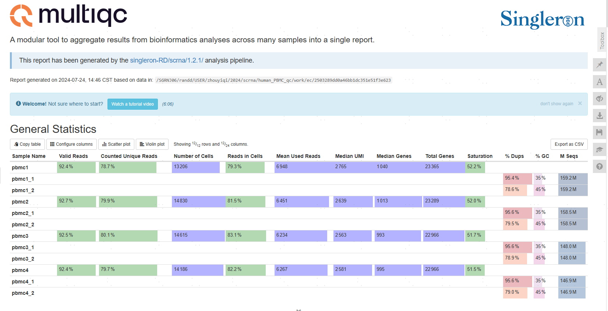

## Usage
1. Create a genomeDir.

### Homo sapiens

```
mkdir hs_ensembl_99
cd hs_ensembl_99

wget ftp://ftp.ensembl.org/pub/release-99/fasta/homo_sapiens/dna/Homo_sapiens.GRCh38.dna.primary_assembly.fa.gz
wget ftp://ftp.ensembl.org/pub/release-99/gtf/homo_sapiens/Homo_sapiens.GRCh38.99.gtf.gz

gunzip Homo_sapiens.GRCh38.dna.primary_assembly.fa.gz
gunzip Homo_sapiens.GRCh38.99.gtf.gz

conda activate celescope
celescope utils mkgtf Homo_sapiens.GRCh38.99.gtf Homo_sapiens.GRCh38.99.filtered.gtf
celescope rna mkref \
 --genome_name Homo_sapiens_ensembl_99_filtered \
 --fasta Homo_sapiens.GRCh38.dna.primary_assembly.fa \
 --gtf Homo_sapiens.GRCh38.99.filtered.gtf \
 --mt_gene_list mt_gene_list.txt
```

### Mus musculus

```
mkdir mmu_ensembl_99
cd mmu_ensembl_99

wget ftp://ftp.ensembl.org/pub/release-99/fasta/mus_musculus/dna/Mus_musculus.GRCm38.dna.primary_assembly.fa.gz
wget ftp://ftp.ensembl.org/pub/release-99/gtf/mus_musculus/Mus_musculus.GRCm38.99.gtf.gz

gunzip Mus_musculus.GRCm38.dna.primary_assembly.fa.gz 
gunzip Mus_musculus.GRCm38.99.gtf.gz

conda activate celescope
celescope utils mkgtf Mus_musculus.GRCm38.99.gtf Mus_musculus.GRCm38.99.filtered.gtf

celescope rna mkref \
 --genome_name Mus_musculus_ensembl_99_filtered \
 --fasta Mus_musculus.GRCm38.dna.primary_assembly.fa \
 --gtf Mus_musculus.GRCm38.99.filtered.gtf \
 --mt_gene_list mt_gene_list.txt
```

2. Generate scripts for each sample.

Under your working directory, write a shell script `run.sh` as

```
multi_rna \
	--mapfile ./rna.mapfile \
	--genomeDir {path to hs_ensembl_99 or mmu_ensembl_99} \
	--thread 16 \
	--mod shell
```
`--mapfile` Required.  Mapfile is a tab-delimited text file with as least three columns. Each line of mapfile represents paired-end fastq files.

1st column: Fastq file prefix.  
2nd column: Fastq file directory path.  
3rd column: Sample name, which is the prefix of all output files.  

Example

Sample1 has 2 paired-end fastq files located in 2 different directories(fastq_dir1 and fastq_dir2). Sample2 has 1 paired-end fastq file located in fastq_dir1.
```
$cat ./my.mapfile
fastq_prefix1	fastq_dir1	sample1
fastq_prefix2	fastq_dir2	sample1
fastq_prefix3	fastq_dir1	sample2

$ls fastq_dir1
fastq_prefix1_1.fq.gz	fastq_prefix1_2.fq.gz
fastq_prefix3_1.fq.gz	fastq_prefix3_2.fq.gz

$ls fastq_dir2
fastq_prefix2_1.fq.gz	fastq_prefix2_2.fq.gz
```

`--genomeDir` Required. The path of the genome directory after running `celescope rna mkref`.

`--thread` It is recommended to use 16 threads. Using more than 20 threads is not advised because  [the mapping speed of STAR saturates at >~20 threads](https://github.com/singleron-RD/CeleScope/issues/197).

`--mod` Create `sjm`(simple job manager https://github.com/StanfordBioinformatics/SJM) or `shell` scripts. 

After you `sh run.sh`, a `shell` directory containing `{sample}.sh` files will be generated.

1. Start the analysis by running:
```
sh ./shell/{sample}.sh
```
Note that the `./shell/{sample}.sh` must be run under the working directory(You shouldn't run them under the `shell` directory)

## Main output
- `outs/{sample}_Aligned.sortedByCoord.out.bam` This bam file contains coordinate-sorted reads aligned to the genome. 
- `outs/raw` Gene expression matrix file contains all barcodes(background + cell) from the barcode whitelist.
- `outs/filtered` Gene expression matrix file contains only cell barcodes.

## Seurat CreateSeuratObject
When using [seurat CreateSeuratObject](https://www.rdocumentation.org/packages/Seurat/versions/3.0.1/topics/CreateSeuratObject), the default `names.delim` is underscore . Since cell barcode is separated by underscore(for example, ATCGATCGA_ATCGATCGA_ATCGATCGA), using `names.delim = "_"` will incorrectly set `orig.ident` to the third segment of barcode. This problem can be avoided by setting names.delim to other characters, such as `names.delim="-"`
```
seurat.object = CreateSeuratObject(matrix, names.delim="-", project="sample_name") 
```

## Additional matrix filter
After completing the `multi_rna` process, you can run `celescope rna cells` to perform cell calling again on the existing results, forced cell number, filtering by minimum gene number, and filtering by maximum mitochondrial gene fraction. It will generate a new expression matrix and HTML report. The original expression matrix and HTML report will be prefixed with `default_`.

### Example

- Adjust Parameters for Cell Calling
https://github.com/alexdobin/STAR/blob/master/docs/STARsolo.md#emptydrop-like-filtering

```
# In celescope V1.*, the default FDR for cell calling is 0.01. In celescope V2.*, the default FDR is 0.001. The following parameters set the FDR to 0.01:

celescope rna cells \
  --soloCellFilter "EmptyDrops_CR 3000 0.99 10 45000 90000 500 0.01 20000 0.01 10000" \
  --outdir test1/cells \
  --sample test1
```

- Force cell number to be 10000, then keep cells with gene>=200 and mitochondrial gene fraction<=0.05.

```
celescope rna cells \
  --force_cells 10000 \
  --min_gene 200 \
  --max_mito 0.05 \
  --genomeDir /genome/rna/celescope2/mmu \
  --outdir test1/cells \
  --sample test1
```


## Multiple samples

The Nextflow-based [singleron-RD/scrna](https://github.com/singleron-RD/scrna) pipeline allows you to easily process multiple samples, obtain results consistent with CeleScope, and generate a single [MultiQC](https://github.com/MultiQC/MultiQC) report that includes QC information for all samples.

